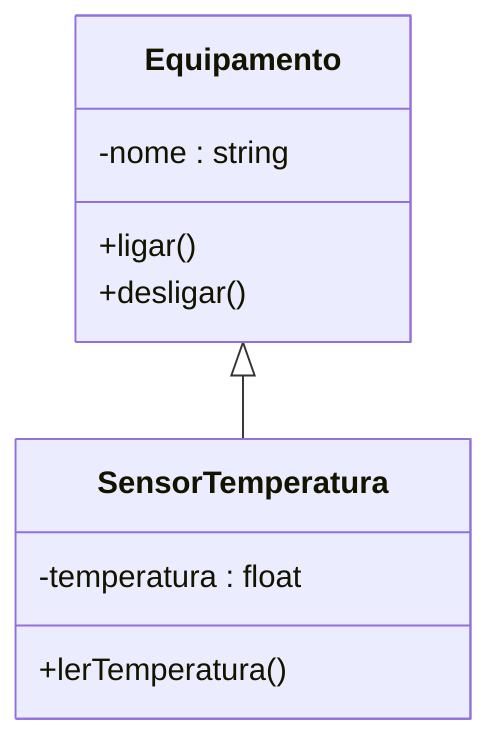

# Diagrama UML - Codigo C++

## 1. Arquivos analisados

* src_cpp/main.cpp
* src_cpp/equipamento.hpp
* src_cpp/equipamento.cpp
* src_cpp/sensor_temperatura.hpp
* src_cpp/sensor_temperatura.cpp

## 2. Link do Mermaid Live

Diagrama validado no Mermaid Live.

## 3. Diagrama final em Mermaid

## 4. Justificativa tecnica

* Foram identificadas as classes Equipamento e SensorTemperatura;
* A classe SensorTemperatura herda de Equipamento;
* As operacoes principais sao ligar, desligar e leitura de temperatura;
* O diagrama representa corretamente a estrutura do codigo C++.

## 5. Evidencias

Diagramas validados no Mermaid Live e visualizados no preview do VS Code.
